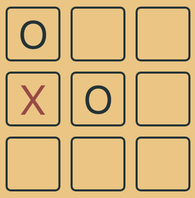

## Tic Tac Toe

### Play

A working version of this project can be found here:

https://sc-tic-tac-toe.herokuapp.com/

This application is an implementation of the game tic-tac-toe and provides a 'computer' opponent.
The following algorithm has been implemented to determine the computer players next move.

#### Algorithm

The algorithm follows these steps in order to determine the next move: 

* Win: If the player has two in a row, they can place a third to get three in a row.

* Block: If the opponent has two in a row, the player must play the third themselves to block the opponent.

* Center: A player marks the center. (If it is the first move of the game, playing on a corner gives the second player more opportunities to make a mistake and may therefore be the better choice; however, it makes no difference between perfect players.)

* Opposite corner: If the opponent is in the corner, the player plays the opposite corner.

* Empty corner: The player plays in a corner square.

* Empty side: The player plays in a middle square on any of the 4 sides.

### To run this locally: 

1. Clone this repo and run `yarn install`

2. Run `yarn start` 

### To run tests:

1. Run `yarn test`

Currently, tests are not complete but more tests will be added shortly.

### Screens
The start screen, where users select their team:

Board:

Losing screen:

Draw screen:

###Authors

* Steven Clouston

